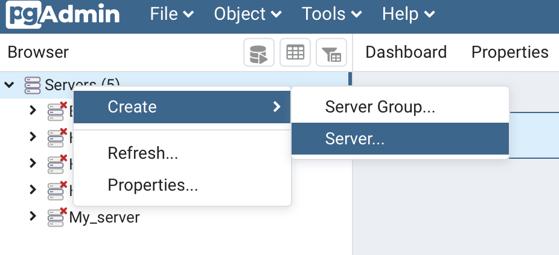

# Guia de uso

Se recomienda leer toda la guia antes de implementar algun cambio (y no implementarlos a medida que se da la primera lectura) ya que aqui se muestra un ejemplo de como resolver la escalabilidad hacia nuevas aplicaciones pero al final se proponen otra alternativa que surgió luego de la escritura del ejemplo aqui mostrado y puede ser muy interesante manejarlo de ese modo.

# Prerequisitos

1. Es de suma importancia leer en su totalidad el documento presentado como Trabajo Final de carrera ubicado [aqui]() para comprender todas las partes y sus relaciones.

2. Poseer un modulo de sensado cuya salida sea el paquete establecido por puerto serie.

# Primer uso

## Broker MQTT

Lo primero a hacer es crear un broker MQTT. En Heroku esto es fácil: 

1. Primero se crea una nueva aplicación:


2. Luego se agrega el broker a la misma yendo a _"Resources"_, buscando _"CloudMQTT"_ y confirmando la selección:

  

_Más información sobre los planes del broker puede encontrarse en: [https://elements.heroku.com/addons/cloudmqtt](https://elements.heroku.com/addons/cloudmqtt)_

## Inicio de los servicios 

Luego es necesario publicar los 3 servicios de la solucion (publisher, suscriber y API hacia la base de datos) para poder mantener el codigo actualizado y funcionando.

1. Cree un repositorio en Github para el Publisher siguiendo los pasos de [esta guia](https://docs.github.com/en/get-started/quickstart/create-a-repo).

2. Tomar el código de la carpeta [Publisher](/Publisher) y subirlo al repositorio.

3. Repetir los pasos 1 y 2 para el código del [Suscriber](/Suscriber) y de la [API](/API).

Con los códigos ya publicados en un repositorio es necesario poner a funcionar el suscriber y la API. Para eso hay que hostearlas en algun lado, la opción más facil es [Heroku](https://heroku.com/) siguiendo los siguientes pasos:

1. Entrar a Heroku y crear una aplicación como se mostró para el broker.

2. Una vez creada hay que conectar el repositorio creado previamente y activar _deploys_ automaticos:


3. Realizar el primer deploy a mano:


Si todo salió bien, en la pestaña general deberá ver el build exitoso y deploy completado:

 


**IMPORTANTE: ESTO APLICA AL SUSCRIBER Y A LA API, NO AL PUBLISHER.**


# Ejemplo de nueva aplicacion

Se desea utilizar el sistema de telemetría para observar la posición de un cuerpo con movimiento en un único eje y la temperatura del mismo. 

## Paso 1: Conocer el formato del payload que llega desde el módulo de sensado. 

Si bien el formato esta estandarizado, hay un campo que es variable y es el payload, donde van las mediciones. Este cambia con cada aplicación y debe definirse de antemano según la transmisión del módulo de sensado.

Para este ejemplo supondremos que el playload se envia de la siguiente manera:

```
payload: DXXTXX
```

Donde D indica el inicio del dato de la distancia, T la temperatura y XX son los datos respectivamente.

## Paso 2: Nuevo topico en el Broker (Si es necesario)

a. Debo tener un tópico en el broker MQTT. Esto dependerá del broker utilizado pero si se continua con el de Heroku: 

 

## Paso 3: Crear base de datos - PostgreSQL

1. Luego voy a crear una app en Heroku donde voy a tener la base de datos agregando el recurso al igual que con el broker:


2. Una vez creado el recurso, tengo que poder conectarme para crear lo necesario y ver el contenido cuando lo haya. Para esto necesito el software [pgAdmin4](https://www.pgadmin.org/download/).

3. Desde este voy a crear un server:



4. Y para los datos necesarios, desde el recurso de Heroku voy a _Settings_ -> _View Credentials_ y completo como muestra debajo. 

_Heroku:_


_Postgres:_

 

Si la conexión es exitosa en la ventana de la izqueirda debería ver el servidor y puedo correr queries para crear las tablas:


5. Para terminar el armado de la base voy a crear las tablas también desde el PgAdmin. Para esto ya hay un script disponibles para las tablas generales ubicado [aqui](/Db/tables_creator.sql) y solo es necesario modificar el de las tablas especificas para el modelo nuevo. Para este ejemplo, dado que medimos una posición y una temperatura tendremos 2 valores numericos y la creación de esa tabla será:

```
CREATE TABLE measurement (
	payload_uuid UUID NOT NULL DEFAULT uuid_generate_v1(),
	segment_id numeric,
	package_id numeric,
	date TIMESTAMP NOT NULL,
	-- replace here the columns for your use case
	position numeric,
	temperature numeric,
	
	-- this should not be replaced
	PRIMARY KEY (payload_uuid),
	FOREIGN KEY (segment_id) 
		REFERENCES segment(id),
	FOREIGN KEY (package_id) 
		REFERENCES package(id)
);
```

6. Por último, debo encodear las credenciales de conexión a base 64 y agregarlas al proyecto del suscriber para que el mismo pueda usarlas en la inserción de los datos.
    
    a. Para el encodeo puedo utulizar cualquier pagina online como [https://www.base64encode.net/](https://www.base64encode.net/). 

	<a name="credenciales-db"></a>
    b. Luego para que el suscriber pueda utilizarlas voy a abrir su aplicación en Heroku, ir a Settings y agregarlas como variables de configuración que luego serán referenciadas desde el código:
    
      

    


## Paso 4: Agregar nuevo caso al Publisher

2 Cosas hay que tener en cuenta en el Publisher, a que broker y a que tópico está publicando.

El sistema esta pensado para funcionar con el mismo broker luego de su creación y poder cambiar facilmente el tópico al que publica si se cambiará la aplicación del equipo. 

El broker se configura en el archivo [_config.py_](/Publisher/config.py) con el host y usuario de acceso que se indica en el broker:

  

Por otro lado, el tópico al que se publica se indica por párametro al iniciar el servicio dentro del equipo. Ubicado dentro del directorio, esto se haría con el comando `python3 main.py <topico>` pero dentro del equipo la publicación está automatizada como un servicio del sistema, por lo que hay que crear una unidad de servicio como se indica en la **sección 7.2.5.2 del Trabajo Profesional** presentado y presente [aquí]().

  


---

**_TIP_**: _El tópico podria cambiarse remotamente con el telecomando creando un script que frene el servicio actual, reescriba este archivo como se desee y lo inicie nuevamente, de forma que manteniendo el equipo publicador en el campo podría tener una aplicación distinta._

---

## Paso 5: Agregar nuevo caso al codigo del Suscriber 

El Suscriber requiere más actualizacioens para un nuevo uso: 

<a name="nuevo-topico"></a>
1. Lo primero es agregar el nuevo tópico a la lista de tópicos conocidos por el Suscriber. Esto se encuentra en el archivo [topics.py](/Suscriber/topics.py) como un **Enum**:

	  

    En nuestro ejemplo, dado que creamos el topico `/example`, el Enum resultante sería (o podrían quitarse los existentes si es que esas aplicaciones no son más utilizadas, a gusto del consumidor):

    ```
    class Topics(Enum):
        SEISMIC = "/pi/test"
        T_AND_H = "/pi/temp"
        ULTRASOUND = "/pi/ultrasound"
        EXAMPLE = "/example'
    ```

<a name="nuevo-modelo"></a>

2. Ahora que puede recibir mensajes del tópico es necesario agregar un módelo para validar la recepción. Para eso vamos a crear un archivo *XXXX_payload.py* dentro de la carpeta [model](/Suscriber/model). En nuestro ejemplo lo vamos a llamar *example_payload.py* y dentro del mismo es necesario definir su clase **que debe heredar la clase Payload** y tener: 

	a) un método [_parse_payload()_](/Suscriber/model/example_payload.py#L5) que defina como se deben leer los datos del payload,

	b) un [constructor](/Suscriber/model/example_payload.py#L19) que lo utilice,
	
    c) una [clase Enum](/Suscriber/model/example_payload.py#L31) con las etiquetas,
	
    d) un método [to_dict()](/Suscriber/model/example_payload.py#L22) que devuelva los atributos de la clase en forma de diccionario, 
	
    e) un método [to_tuple()](/Suscriber/model/example_payload.py#L26) que devuelva los atributos de la clase en forma de n-upla. 

    Acá es donde se pierde la generalidad del sistema ya que hasta este punto cualquier cosa que se transmita se iba a recibir, peor ahora es cuando se valída la información frente a un modelo de datos.

    En nuestro ejemplo, el archivo [*example_payload.py*](/Suscriber/model/example_payload.py) sería:

    ```
    from enum import Enum
    from model.payload import Payload


    def parse_payload(payload): # (1) Como dijimos, el payload es: DXXTXX, aca lo parseo a 2 variables separadas
        if payload == "FAIL":
            d_measure = None
            t_measure = None
        else:
            d_position = payload.upper().index("D")
            t_position = payload.upper().index("T")
            t_measure = payload[t_position + 1:]
            d_measure = payload[d_position + 1:t_position]
        return [d_measure, t_measure]


    class ExamplePayload(Payload):  # (2) Aqui se indica la herencia de la clase Payload

        def __init__(self, payload):  # (3) En el mismo constructor se indican los atributos de la clase y se parsea el paylaod
            self.distance, self.temperature = parse_payload(payload)

        def to_dict(self):  # (4) Devuelve de la forma {tag1: atributo1, tag2: atributo2, ...}
            return {ExamplePayloadTags.distance.name: self.distance,
                    ExamplePayloadTags.temperature.name: self.temperature}

        def to_tuple(self): # (5) Devuelve de la forma (atributo1, atributo2, ...)
            return (self.distance,
                    self.temperature)


    class ExamplePayloadTags(Enum): # (6) Los tags para usar en el diccionario y no manejar stings que llevan a errores humanos
        distance = 1
        temperature = 2

    ```

3. Una vez creado el modelo y sus reglas de parseo hay que agregar la orden para qu en cada recepción se construya y efectivamente se valide el formato. Esto se hace en el archivo [segments.py](/Suscriber/model/segment.py), en el método [`build_payload()`](/Suscriber/model/segment.py#L20). Nuevamente puede extenderse para funcionar para este modelo y otros o reeplazar alguno de los existentes en el codigo que ya no se utilicen. Si lo extendemos es simplemente agregar las siguientes lineas, donde es importante destacar que se hace referencia al topico agregado [aqui](#nuevo-topico):

```
        elif payload_type == Topics.EXAMPLE.value:
            return example_payload.ExamplePayload(**payload)
```


4. Por último, ya con la recepción y validación del modelo terminado, es necesario enviarlo a almacenar. La encargada de todas las operaciones relacionadas con la base de datos es la API que en este repositorio se encuentra en la carpeta [API](/API). Esto se hace en el método [`upload_to_database()`](/Suscriber/upload_database.py#L26) del archivo [upload_database.py](/Suscriber/upload_database.py) y nuevamente podemos extender o reemplazar. Para extender es necesario agregar lo siguiente, donde:

1. El tópico de la priemra linea es el agrgado [aqui](#nuevo-topico).
2. Los nombres de las credenciales de la siguiente línea son [estas](#credenciales-db).
<a name="nuevo-endpoint"></a>
3. Y el `"example"` al final en el endpoint debe representar a esta nueva aplicación, lo referenciaremos en el próximo paso. 

```
    elif topic == mqtt_client.Topics.EXAMPLE.value:
        db_creds = db_credentials.DbCredentials(base64.b64decode(os.environ['EX_USR']).decode('utf-8'),
                                                base64.b64decode(os.environ['EX_SCRT']).decode('utf-8'))
        endpoint = BASE_ENDPOINT + "example"
```


## Paso 6: Agregar comunicación con nueva base de datos en la API

Para terminar la adopción de una nueva aplicación es necesario adaptar la API para que pueda almacenar el nuevo módelo en la nueva base de datos.

<a name="payloadType-API"></a>
1. Lo primero es agregar al enum PaylaodTypes en el archivo de [constants.py](/API/constants.py)

      

    <a name="DbCons-API"></a>
2. En este archivo de constantes tambien es necesario agregar host y base de datos nuevas como constantes de la forma: 

    ```
    EXAMPLE_DATABASE_HOST = <db host>
    EXAMPLE_DATABASE = <db>
    ```

    donde los valores se pueden obtener de [aquí](#credenciales-db).

3. Luego, al igual que en el suscriber, es necesario agregarle la habilidad de recibir este nuevo mensaje. Para eso, al ser una API debemos agrgarle un nuevo _endpoint_. Esto se hace en el archivo principal [app.py](/API/app.py)

    Para eso voy a copiar uno de los metodos ya existentes y hacerle unas modificaciones.

    a) La primera linea `@app.route()` es un decorador, en esta lo importante es que el prime   ro parametro sea `/` + EL MISMO nombre que definimos [aquí](<#nuevo-endpoint), ya que ahí se define la url del nuevo endpoint, en este caso, `/example`.

    b) Además en la línea siguiente vamos a querer cambiar el nombre del método a algo significativo para nuestra aplicación, como podria ser `upload_example`. 

    c) En la línea 4 es necesario actualizar el tipo de payload que se espera recibir, para validar contra nuestro modelo de base de datos. Esto se en el primer argumento del constructor del paquete que se esta llamando en esa linea (`package.Package()`) con el valor agregado en el [paso 1](#payloadType-API) de esta sección.

    ```
    pack = package.Package(constants.PayloadTypes.example.name, **request.json['package'])
    ```

    d) Por último, en la línea 11 es necesario actualizar host y base de datos nuevas por las constantes creadas en el [paso 2](#DbCons-API) de esta sección:

    ```
    session_instance = db_operations.DbSession(credentials, constants.EXAMPLE_DATABASE_HOST, constants.EXAMPLE_DATABASE)
    ```

    De esta manera, el nuevo método quedaría:

    ```
    @app.route('/example', methods=['POST'])    # (1) url del endpoint
    def upload_temp_and_humidity(): # (2) nobmre del metodo
        if not request.json:
            return Response(response="{'error': 'Missing package'}", status=400)
        try:
            pack = package.Package(constants.PayloadTypes.example.name, **request.json['package']) # (3) Tipo de Payload a recibir
            credentials = db_credentials.DbCredentials(**request.json['Db_connection'])
        except TypeError as e:
            return Response(response="malformed http body", status=400)

        # Establish connection
        try:
            session_instance = db_operations.DbSession(credentials, constants.EXAMPLE_DATABASE_HOST, constants.EXAMPLE_DATABASE)    # (4) Nuevo host y base de datos
        except (Exception, psycopg2.Error) as error:
            print("Database authentication failed")
            return Response(response="Database authentication failed", status=401)

        try:
            session_instance.upload_package(pack)
        except (Exception, psycopg2.Error) as error:
            print("Failed to insert records with error:", error)
            return Response(response=f"Failed to insert records with error: {error}", status=400)
        return Response(response="Package stored successfully", status=200)
    ```

4. Ahora es necesario que conozca el modelo que va a guardar en la base de datos (que no es lo mismo que el modelo de datos del Suscriber, cada entidad representa un objeto en su propia forma y es independiente de la otra). Y este tambien se  agregana en un archivo *example_payload.py* a la carpeta [model](/API/model/) pero con algunos cambios ya que este es EL MODELO QUE SE GUARDARA EN LA BASE, es decir, con los elementos que definí en el [tables_creator.sql](/Db/tables_creator.sql#L28), por lo que también tengo un campo de fecha. Además tengo 2 agregados: 

	a. Una constante `EXAMPLE_TABLE_NAME = "measurement"` con el nombre de la tabla donde se insertará. (El mismo se definió al correr los scripts de creación de la base [aquí](/Db/tables_creator.sql#L24)).

	b. Y vamos a incluir la query para su inserción a la base de datos en un método `get_insert_query()`, en este caso, si mantenemso los nombres por defecto la query sería:

    ```
    INSERT INTO measurement (package_id, segment_id, date, position, temperature) VALUES (%s,%s,%s,%s,%s)"
    ```

    Donde es importante notar que primero se indican todas las columnas y luego en los valores se indica con `%s` que esos campos se completarán durante la ejecución con `strings`.


    De esta manera, el archivo [example_payload](/API/model/example_payload.py) para la base de datos quedaría:

    ```
    from enum import Enum
    from model.payload import Payload

    EXAMPLE_TABLE_NAME = "measurement"  # (1) Nueva constante con el nombre de la tabla

    class ExamplePayload(Payload):  # (2) Aqui se indica la herencia de la clase Payload

        def __init__(self, date, temperature, distance):  # (3) En el mismo constructor se indican los atributos de la clase y se parsea el paylaod
            self.date = datetime.strptime(str(date), '%Y%m%d%H%M%S').strftime('%m/%d/%Y %H:%M:%S')
            self.temperature = temperature
            self.distance = distance

        def to_dict(self):  # (4) Devuelve de la forma {tag1: atributo1, tag2: atributo2, ...}
            return {TemperaturePayloadTags.date.name: self.date,
                    ExamplePayloadTags.distance.name: self.distance,
                    ExamplePayloadTags.temperature.name: self.temperature}

        def to_tuple(self): # (5) Devuelve de la forma (atributo1, atributo2, ...)
            return (self.date,
                    self.distance,
                    self.temperature)

        def get_insert_query(self): # (6) Nuevo metodo con la query para insertar en la base de datos
            return f"INSERT INTO {EXAMPLE_TABLE_NAME} (package_id, segment_id, date," \
                f"position, temperature) VALUES (%s,%s,%s,%s,%s)"


    class ExamplePayloadTags(Enum): # (7) Los tags para usar en el diccionario y no manejar stings que llevan a errores humanos
        date = 1
        distance = 2
        temperature = 3
    ```

5. Por último, al igual que en el Suscriber, hay que agregar la orden para qu en cada recepción se construya y el objeto a guardar. Esto se hace en el archivo [segment.py](/API/model/segment.py), en el método [`build_payload()`](/API/model/segment.py#L20). Nuevamente puede extenderse para funcionar para este modelo y otros o reeplazar alguno de los existentes en el codigo que ya no se utilicen.

    ```
    elif payload_type == Topics.EXAMPLE.value:
        return example_payload.ExamplePayload(**payload)
    ```

# Propuestas

## 1
Otra alternativa que es de mi agrado para manejar los nuevos casos sería:

1. mantener el codigo para un solo caso, es decir por ejemplo, que el Enum de Topicos del suscriber tenga solo 1 aplicacion, Seismic por ejemplo, en los modelos solo este esa aplicacion y lo mismo para la base de datos y el resto de los servicios, solo contar con las cosas de esa aplicación.
2. Crear una [Branch](https://docs.github.com/es/github/collaborating-with-pull-requests/proposing-changes-to-your-work-with-pull-requests/about-branches) en GitHub POR CADA APLICACIÓN, y dentro de cada branch contar con el codigo especifico para esa aplicación.
3. Es decir, en cada servicio (publisher, suscriber y API hacia la base de datos) tendrían una branch por aplicación (sensor sismico, nivel de agua, temperatura, etc...) con el código especifico para esa aplicación.

## 2
Si el sistema resulta de valor y se lo continua utilizando se propone también tomarse el tiempo de invetigar la posibilidad de refactorizarlo a lo que se conoce como arquitectura _config oriented_, donde los servicios cargan archivo de configuraciones ubicados en repositorios remotos y en estos archivos (por lo general en algun formato tipo JSON) se encuentra todo lo que hoy cambiamos en el código para un nuevo caso. De esta manera, para una nueva aplicación basta con agrgar archivos nuevos de configuración y no tocar cosas ya existentes.
